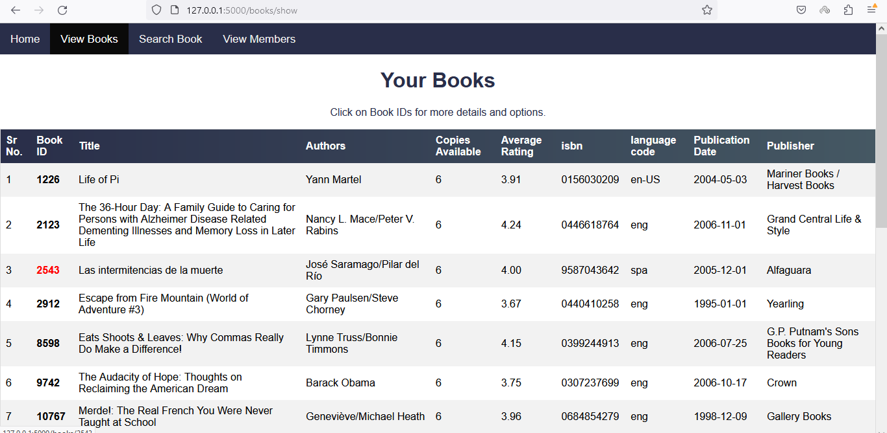

# Library Management App

This application is designed to assist librarians in managing books, members, and transactions in a local library.


## Tech Stack

- **Backend**: Python with Flask
- **Database**: SQLite
- **Frontend**: HTML, CSS
- **ORM**: SQLAlchemy


## Table of Contents

- [Features](#features)
- [Getting Started](#getting-started)
  - [Prerequisites](#prerequisites)
  - [Installation](#installation)
- [Functionalities](#functionalities)
  - [CRUD Operations](#crud-operations)
  - [Issue and Return](#issue-and-return)
  - [Search](#search)
  - [Debt Management](#debt-management)
  - [API Integration](#api-integration)
## Features

- **Base Library System:**

  - Perform CRUD operations on Books and Members
  - Issue books to members
  - Record book returns from members
  - Search for books by name and author
  - Charge rent fees on book returns
  - Enforce a limit of Rs.500 for a member's outstanding debt
  - Integration for Data Import.

- **Import books using the Frappe API**
  - Retrieve 20 books at a time
  - Accept parameters such as title, authors, isbn, publisher, and page
## Getting Started

### Prerequisites

- [Python](https://www.python.org/)
- [pip](https://pip.pypa.io/en/stable/installation/)
- [virtualenv](https://virtualenv.pypa.io/en/latest/installation.html) (recommended)


### Installation

Clone the repository:

```bash
  git clone https://github.com/kan-didwania/LibraryManagementApp.git
```

Navigate to the project directory:

```bash
  cd LibraryManagementApp
  ```

Create a virtual environment (optional but recommended):

```bash
virtualenv venv
source venv/bin/activate   # On Windows, use "venv\Scripts\activate"

```
Install the project dependencies:

```bash
pip install -r requirements.txt
```

Ensure you are in the project directory and the virtual environment is activated.

Run the Flask application:

```bash
flask run
```

Access the application in your browser at http://localhost:5000.

## Functionalities

- CRUD Operations:
  
  - Manage books and members through the provided CRUD operations.
  - Also see the current issued books and the returns.

- Issue and Return Books:
  
  - Issue books to members and record their return.
- Search for Books:
  
  - Search for books based on title and author.
- Rent Fee and Debt Management:

  - Charge rent fees on book returns. 
   - Enforce a limit of Rs.500 for a member's outstanding debt.

- API Integration:
  
  - Import books using the Frappe API with parameters.

### CRUD Operations

- The librarian can perform all basic operations for books and members.
  
   - View all books in the library

   

   - Click on the book id to get book details and options for edit, delete, issue and see the members who have currently issued the book.

  

   
   
   

   

- The librarian gets the option to see the ongoing issues and returns from the home page.

    

    
   
   
### Issue and Return

- A book can be issued to a member if he has a valid member id.

- A book can only be issued to the member if his outstanding debt is not greater than or Rs 500

- A return can be initiated from the member details page.

  

### Search


### Debt Management 

Member with debt greater than 500 cannot issue a book.


### API Integration

- Option to import books using Frappe API from the home page.

- The librarian can set the quantity for each book that is imported from the library. A default quantity of one is set for all the books imported. 

  